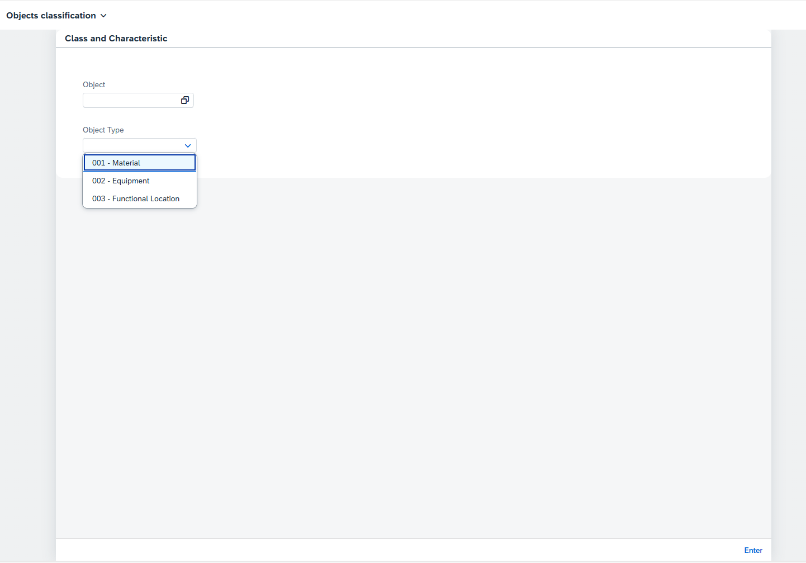

## SAPUI5 Object Classification

Enhanced experience for class/classification in SAP S4 HANA. This application is based on the idea of the Migration Cockpit's object classification app. The main objective of this application is to provide grounds for having an enhanced user experience in the classification system usage, an important but often neglected functionality due to the current S4 transaction-based experience being a bit user-unfriendly.

Therefore, using SAPUI5 to develop a new, custom and fresh application following Fiori guidelines is interesting to keep those users active in the application.

### Features
- General object classification (one at a time)
- Class/characteristic validation based on the models' data
- Allows displaying classes of objects and their corresponding characteristics in a tabular format

### Sample Usage

#### Main Screen

- Minimal input screen for single-data items which supports validation against the data model: objects can have only their own class type (this validation is similar to the one done in the ABAP Server)



- Selection of object based on the class type allows a better UX to query the data (more query parameters can also be added to avoid overfetching)


#### Detail Screen

- Detail view shows the user all the classes that have the type selected for the object selected. When a class is selected, the characteristics are displayed, along with their corresponding values for the assignment


- The user can change, add or remove class assignments


### Starting the app

-   This app has been generated using the SAP Fiori tools - App Generator, as part of the SAP Fiori tools suite.  In order to launch the generated app, simply run the following from the generated app root folder:

```
    npm start
```

- note that this is valid for running in your local development environment. to host this app in a S4/BTP instance, please follow the corresponding instructions in https://help.sap.com

#### Pre-requisites:

1. Active NodeJS LTS (Long Term Support) version and associated supported NPM version.  (See https://nodejs.org)
2. UI5 CLI [tools](https://www.npmjs.com/package/@ui5/cli)


### Application Details
This app was generated from the Fiori Generator extension for VSCode, blank app as below.

|               |
| ------------- |
|**App Generator**<br>@sap/generator-fiori-freestyle|
|**App Generator Version**<br>1.17.0|
|**Generation Platform**<br>Visual Studio Code|
|**Template Used**<br>simple|
|**Service Type**<br>None|
|**Service URL**<br>N/A|
|**Module Name**<br>com.grilo.classification|
|**Application Title**<br>Objects classification|
|**Namespace**<br>com.grilo.classification|
|**UI5 Theme**<br>sap_horizon|
|**UI5 Version**<br>1.134.0|


